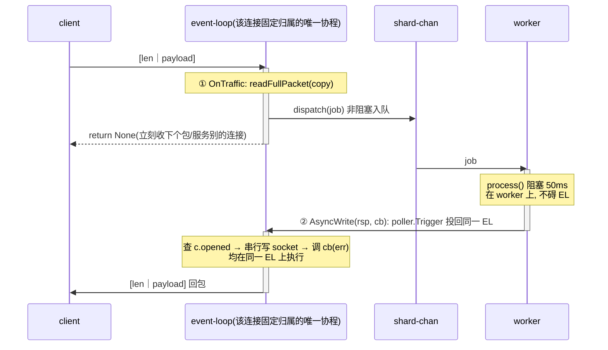

# 模型三·进阶：事件驱动（gnet）+ 协程池卸载阻塞业务

配套文章《Go 长连接服务的三种读写并发模型》 §2.3 的进阶 demo。

文章：<https://wenfh2020.com/2026/06/25/go-longconn-concurrency-models/>

## 它解决什么

`model3_gnet` 的 `process()` 是纯内存、非阻塞的。但真实业务里 `OnTraffic` 常要查
redis/mysql、跑复杂逻辑——这些是**阻塞操作**，放进 `OnTraffic` 会卡住该 event-loop
上的**所有**连接。正确姿势是：

> event-loop 只做「非阻塞拆包 + 派发」，阻塞业务甩给**有界协程池**，处理完用
> `AsyncWrite` 异步回包。

本 demo 用 [ants](https://github.com/panjf2000/ants) 承载一个**分片（sharded）协程池**，
并把「并发安全」这件事做对。

## 核心设计

- `numShards`（≈ CPU 核数）条带缓冲任务 channel，每条由 ants 池里一个常驻 worker 串行消费。
- 按 `ConnId` 哈希把**同一连接**恒定路由到**同一 shard**：
  - 同连接的包被同一 goroutine FIFO 串行处理 → 回包**严格有序**；
  - 不同连接分散到不同 shard → **并行**，并发度封顶 = `numShards`；
  - `OnTraffic` 只做非阻塞 channel send → **event-loop 永不阻塞**；
  - channel 满 → `select-default` 非阻塞丢弃 → **背压**。

## 架构拓扑

```
   TCP 连接 (N 条, 可百万)          ┌──────────────────── gnet 引擎 ────────────────────┐
   c1 c2 c3 ............. cN  ──▶  │  epoll  ──▶  event-loop 协程 × 核数(固定, 与连接数解耦) │
                                   │             EL-0   EL-1   ...   EL-7                │
                                   └───────┬───────────────────────────────────────────┘
                                           │ OnTraffic: readFullPacket(copy) + dispatch
                                           │ 【非阻塞】event-loop 绝不等业务, 派发完立刻收下一个包
                                           ▼
                         shard = fnv(ConnId) % numShards   ← 同一 ConnId 恒定命中同一 shard
                                           │
        ┌───────────────┬──────────────────┼──────────────────┬───────────────┐
        ▼               ▼                  ▼                  ▼               ▼
   shard[0] chan    shard[1] chan     shard[2] chan       ...          shard[7] chan   ← 带缓冲队列(cap 256)
   [job│job│..]     [job│..]          [job│job│job]                    [ ]             ← 满 → select-default 丢弃(背压)
        │               │                  │                                  │
        ▼               ▼                  ▼                                  ▼
   worker-0         worker-1           worker-2            ...            worker-7      ← ants 承载, 固定 numShards 个
   drainLoop        drainLoop          drainLoop                         drainLoop     ← 单 goroutine 串行消费本 shard
        │               │                  │                                  │
        │  process(阻塞 50ms: 查 redis/mysql) ──▶ rsp                          │
        └───────────────┴──────────┬───────┴──────────────────────────────────┘
                                   ▼
                 c.AsyncWrite(rsp, cb)  ──▶  poller.Trigger 投回【该连接的】event-loop
                 └─ 执行时查 c.opened → 串行写 socket(框架保证同连接写并发安全)
                 └─ cb(err): err != nil ⇒ 连接已关, 安全丢弃(worker 与 OnClose 竞态的兜底)
```

**关键不变量**：`同一 ConnId → 同一 shard → 同一 worker → 单 goroutine FIFO`，这条链保证同连接回包
**严格有序**；而不同连接散落到不同 shard 实现**并行**，并发度封顶 = `numShards`。

## 数据流（时序图）

一条请求从进来到回包，`①` 收包派发、`②` 回写是**同一条 EL 泳道上先后两次激活**；`process` 的
50ms 阻塞发生在 worker 泳道，所以 EL 在 `①` 之后立刻空闲、去服务别的连接。



## 并发安全为什么成立（已读 gnet v2.9.8 源码验证）

1. gnet **不复用 `*conn` 对象**（`connection_unix.go` 每条连接 `newStreamConn` 都是新
   `&conn{}`，`release()` 只置空不入池）→ worker 握着的 `c` 永远是同一条逻辑连接，
   **不可能串台** → 回包直接用捕获的 `c`，**无需 ConnId 重查连接表防串台**。
2. `AsyncWrite` 把写任务投到该连接的 event-loop，**执行时刻**才查
   `if !c.opened { return net.ErrClosed }`，与 `OnClose` 在同一 event-loop 串行 →
   worker 处理途中连接被关，最坏是回调拿到 `net.ErrClosed`，安全丢弃、不 panic。
3. 所以真正要做的安全动作只有：**拆包后 copy**、**用有界池而非裸 `go`**、
   **`AsyncWrite` 用 callback 观察 err**（返回值只表示入队成败）、**注意同连接乱序**。

## `AsyncWrite` 到底做了什么（为什么并发调用安全）

关键认知：**worker 协程和 event-loop 是两个不同的 goroutine，几乎总在不同 OS 线程上并行**。
如果 worker 直接 `c.Write()`（同步写）操作 socket，就会和 event-loop 的读**并发**摆弄同一条
连接的内部状态 → 数据错乱/panic。`AsyncWrite` 的存在，正是为了跨这个线程边界安全移交。

`AsyncWrite` **只入队、不马上发**，内部是典型的 **MPSC（多生产者 / 单消费者）**：

- **生产者端（任意 worker 协程）**：把「写任务 + 数据」push 进该连接所属 event-loop 的
  **并发安全任务队列**，再通过 `eventfd` 捅一下唤醒 `epoll_wait`。到此 worker 的活就干完了，
  **没有任何 syscall send**。
- **消费者端（event-loop 单协程）**：被唤醒后把任务队列**一次性抽干**，逐个执行——**这里**才
  `if !c.opened` 检查 + 真正 `syscall write`。真正碰 socket 的**永远只有 event-loop 一个协程**。

由此得到两条结论：

1. **并发安全是 gnet 白送的**：N 个 worker 并发 `AsyncWrite` 同一条连接，都只是往队列 push
   （多生产者安全），发送被单 loop 串行化，绝不会互相踩——**不依赖任何「单 worker 绑定」**。
2. **唤醒会被合并**：gnet 的 `poller.Trigger` 用 `CAS(wakeupCall, 0, 1)` 决定要不要写 `eventfd`。
   高并发下一批 `AsyncWrite` 只有**第一个**真正触发唤醒 syscall，其余直接跳过；等 loop 抽干队列
   再把标志置回。**N 次入队最多 1 次唤醒 syscall**，避免高 QPS 下被唤醒 syscall 打满 CPU。

> **用哪个写**：在 event-loop 回调里（`OnOpen`/`OnTraffic`/`OnClose`）→ 直接 `Write`；
> 在**任何其它协程**里 → 必须 `AsyncWrite`。

**`opened` 检查为什么有效**：不在于那个 `if`，而在于它**在 event-loop 的执行时刻**才求值 ——
`opened` 的翻转（`OnClose`）和检查（`AsyncWrite` 落地）都在**同一个 loop** 里串行，不会交叉。
若改在 worker 调用时刻检查，就是经典 **TOCTOU 竞态**（查到 `true` → 连接关闭 → 再 send → 炸）。

## 写安全 ≠ 回包有序（两个独立的保证，别混）

| 保证 | 靠什么 | 是否依赖「单 worker 绑定连接」 |
| :--- | :--- | :--- |
| **写安全**（不错乱、不串台、不 panic） | `AsyncWrite` 串行化到 event-loop + `opened` 检查 | **不依赖**——并发多 worker 写同一连接也安全 |
| **回包严格有序** | 同 `ConnId` → 同 shard → 单 goroutine FIFO | **依赖**——这才是本 demo 分片绑定的**唯一目的** |

一句话：**即使允许多个协程处理同一条连接，写也不会出错（AsyncWrite 兜底），只是回包会乱序。**
本 demo 用单 worker 绑定连接，图的是**有序**，不是图写安全。

## 运行

```sh
go run .          # 观察四个场景日志
go run -race .    # 核心：worker 并发 AsyncWrite + 与 OnClose 竞态，应无 data race 告警
```

## 四个场景（自驱动 server+client 同进程）

| 场景 | 看点 |
| :--- | :--- |
| A | 200 条连接、业务阻塞 50ms，服务端 goroutine 仍固定 = event-loop + worker，与连接数解耦 |
| B | 200 条阻塞请求实际 ~1.3s（池并行 `ceil(200/shards)*50ms`），而非串行 10s |
| C | 同连接连发 `msg-1..msg-10`，回包**严格有序**——哈希到固定 worker 串行的证明 |
| D | 单连接猛灌 500 包打满一个 shard 队列（容量 256），触发**背压丢弃** |

## 预期输出（节选）

```
[场景B] 200 条 ping 全部处理完：实际耗时 = 1.37s（串行需 ~10s，池并行理论 ~1.25s）
[场景A] ... goroutine = 24 —— event-loop(8)+worker(8) 固定，不随连接数涨
[场景C] 同连接连发 10 包，回包严格有序 msg-1..msg-10 ✓
[场景D] 单连接猛灌 500 包 ...：背压丢弃 = 243 个
[main] 汇总：已处理 = 217, 背压丢弃 = 243, 回包遇连接已关 = 1
```

`-race` 全程干净：worker 并发 `AsyncWrite`、与 `OnClose` 的竞态，全靠 gnet 的
「conn 不复用 + event-loop 串行落地」兜底，业务侧无锁。

## 生产环境参数怎么配（IO 型业务）

demo 里 `numShards = NumCPU`、队列 `256` 是为演示方便，**生产不能照抄**。核心原则：

> **并发度不由核数定，由 [Little's Law](https://en.wikipedia.org/wiki/Little%27s_law) 定**：
> `所需并发 W = 目标 QPS × 单请求平均时延`；而**真正的天花板是下游**（redis/mysql 连接池）。
> 对 IO 型业务，`NumCPU` 个 worker **远远不够**——worker 大部分时间阻塞在 IO 等待上、并不占核。

以 **16 核 / 32G**、单请求 ≈ 平均 15ms（P99 50ms）、mysql 池 200 / redis 池 300 为例：

| 参数 | 推荐值 | 依据 |
| :--- | :--- | :--- |
| event-loop 数（`WithNumEventLoop`） | **16**（= 核数） | 只做非阻塞拆包派发，CPU 型 |
| `numShards`（worker 并发） | **256** | 对齐下游瓶颈（mysql 池 200 最紧），再大只会堆在池上等连接 |
| `shardQueueCap`（队列长度） | **32** | 按 `客户端超时 ÷ 单包时延` 反推；队列是吸收突发的缓冲，**不是蓄水池** |

**三条红线**：

1. **`numShards` 封顶看下游、不看核数**——下游连接池扩大了，这里才跟着涨。
2. **队列要短**——`256 × 100ms = 25s` 的排队没有意义（客户端早超时了）；宁可早触发背压丢弃/降级。
3. **务必给下游 IO 配 context 超时 + 熔断**——worker 卡在慢查询上会被瞬间占满、队列打满、开始丢包；
   这是这套模型在生产不雪崩的前提。

**内存**：16C/32G 这种规格是奔着**海量长连接**去的。协程池那点结构体（几十 MB）可忽略，
32G 主要留给 gnet **每连接读写 buffer**，按每连接 ~4KB 估算可扛**百万级**长连接。
